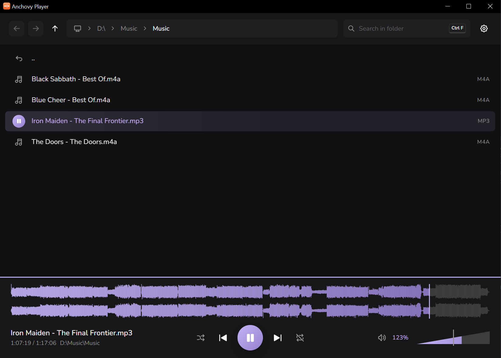

<div align="center">


# Anchovy Player

**A calm, modern desktop audio player built around a file browser.**
Walk a folder with the arrow keys and hear every file the instant it is selected - even a 20 ms click.

</div>

---

<!-- Replace the placeholder with docs/media/screenshot-main.png once there is a real screenshot. -->
<p align="center">
  
</p>

## Why

Most players rebuild their whole pipeline for every file: open the container, start a decoder, wake the audio device, fill a buffer. For a song that is invisible. For a folder of short sound effects it is fatal - a 50 ms sample is over before the device is awake, so in VLC and friends you often hear nothing at all. Dedicated sample browsers solve this, but they are paid, heavy, or both.

Anchovy Player is built the other way round. The output device is opened once and kept, files are decoded ahead of time, and starting a sound is just swapping the source in a mixer. The result is a player you can audition hundreds of SFX with, one arrow key at a time - and that is still pleasant for an album in the evening.

## Goals

- **Instant.** Every interaction answers at once; playback starts the moment a file is selected, including files a few milliseconds long.
- **Fast to navigate.** The file browser is the main view, not a dialog. Folders, search, history and playback are all under your fingers.
- **Good-looking.** Large, calm, modern UI with soft surfaces and one pastel accent, in light and dark. Closer to a premium hardware player than to a developer tool.
- **Thoughtful UX.** Sensible defaults, nothing to configure before it is useful, and behaviour that does what you meant.

## Features

### Browse

- **Integrated file browser** with Explorer-style breadcrumbs, back/forward history (including the mouse's side buttons) and a live view: files added, renamed or re-exported on disk show up without a refresh.
- **Play on focus** - move through a folder with the arrow keys and each audio file plays as it is selected. Turn it off and it behaves like a regular player.
- **Jump to name** by typing, and a fuzzy **search** across the folder and its subfolders (`Ctrl+F`).
- **Explorer-grade file actions**: multi-select, cut / copy / paste compatible with Explorer's clipboard, rename, delete to the recycle bin, drag files out into other apps.
- Files you have already heard are dimmed for the session, so you never lose your place in a big library.

### Play

- **Zero-latency start**, pre-decoding of the neighbours of the focused file, and gapless looping.
- **Waveform** with click and drag to seek, per channel, fast even for hour-long mixes.
- **Repeat** off / one / group, **shuffle** that plays everything once before repeating, and an adjustable pause between tracks so short clips do not turn into a machine gun.
- **Resume where you left off** for long tracks - remembered by content, not by file name or path.
- **Volume up to 200%** on a VLC-style wedge, with an accelerating step: precise 1% taps, fast when you hold the key.
- A subtle **visualizer**: the playing row and the waveform breathe with the music. Each has its own intensity slider, down to off.

### Live with it

- Keyboard-first: two focus zones (list and player) with their own arrow keys, plus global shortcuts for play/pause, volume, mute, repeat and search.
- **Open with Anchovy Player** in Explorer's context menu for files and folders, optional at install.
- Minimizes to the tray, reopens the last folder, follows the system theme and language (English and Russian).
- Any accent colour - the whole palette, light and dark, is derived from it.

## Formats

WAV, AIFF, CAF, MP3 (and MP1/MP2), Ogg Vorbis, Opus, FLAC, AAC and ALAC (M4A/MP4), Matroska/WebM audio and ADPCM. Decoding is done by [Symphonia](https://github.com/pdeljanov/Symphonia) and libopus - no FFmpeg, no codec packs. WMA and APE are not supported.

## Platform

Windows 10 and 11 today. The code keeps platform-specific parts isolated, so a Linux build is planned to be a small step rather than a rewrite.

## Keyboard

| Where     | Keys                               | Action                         |
| --------- | ---------------------------------- | ------------------------------ |
| Anywhere  | `Space`                            | Play / pause                   |
|           | `Ctrl+↑` / `Ctrl+↓`, `Ctrl+wheel`  | Volume                         |
|           | `Ctrl+M`                           | Mute                           |
|           | `Ctrl+R`                           | Cycle repeat                   |
|           | `Ctrl+F`                           | Search                         |
|           | `Tab`                              | Switch between list and player |
|           | `Alt+←` / `Alt+→`                  | Back / forward                 |
| File list | `↑` `↓` `PgUp` `PgDn` `Home` `End` | Move (with `Shift`: select)    |
|           | `→` / `Enter`                      | Open folder / play file        |
|           | `←` / `Backspace`                  | Parent folder                  |
|           | `F2`, `Del`, `Ctrl+C` / `X` / `V`  | Rename, recycle, clipboard     |
| Player    | `←` / `→`                          | Seek 5 s (with `Shift`: 1 s)   |
|           | `↑` / `↓`                          | Previous / next track          |

## Building from source

Prerequisites: [Rust](https://rustup.rs) with the MSVC toolchain and [Node.js](https://nodejs.org). Everything else (CMake and Ninja for libopus) is downloaded and checksum-verified by `npm install`.

```bash
npm install
npm run dev          # run in development
npm run tauri build  # installer in src-tauri/target/release/bundle/nsis/
```

The installer is a single self-contained `.exe` of a few megabytes: the C runtime and libopus are linked statically.

## Built with

[Tauri 2](https://tauri.app) and Rust for the audio engine ([cpal](https://github.com/RustAudio/cpal), [Symphonia](https://github.com/pdeljanov/Symphonia), [rubato](https://github.com/HEnquist/rubato)); React, TypeScript and [Mantine](https://mantine.dev) for the interface; [Tabler Icons](https://tabler.io/icons) and the Nunito typeface.

## License

Anchovy Player is free software, licensed under the [GNU General Public License v3.0 or later](LICENSE). You may use, study, share and modify it; anything you distribute that is built on it must be released under the same license, with its full source code.

The name "Anchovy Player" and its icon are not covered by the license. Forks and redistributed builds are welcome under a different name and icon, so nobody mistakes them for the original.
